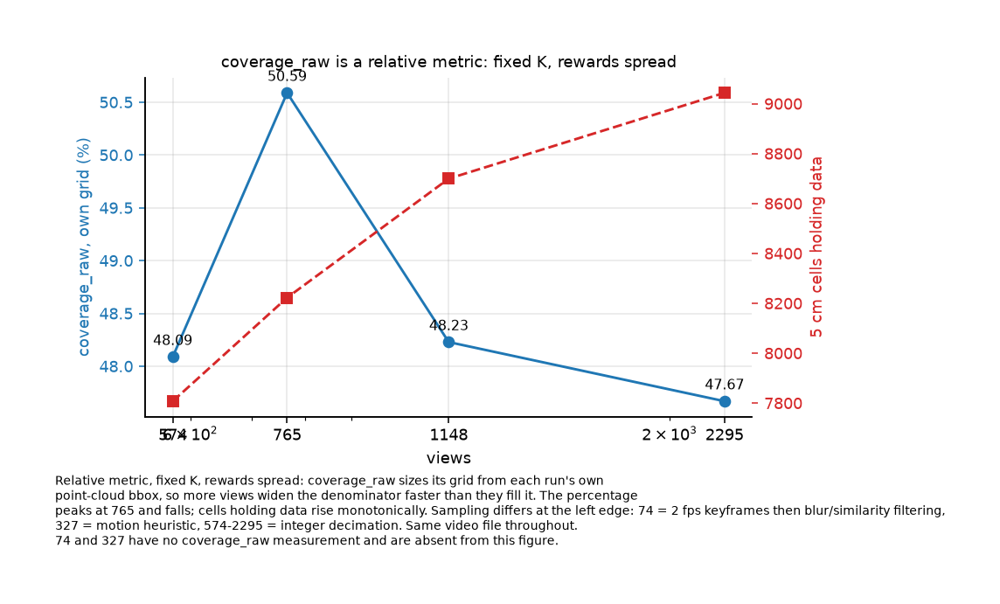
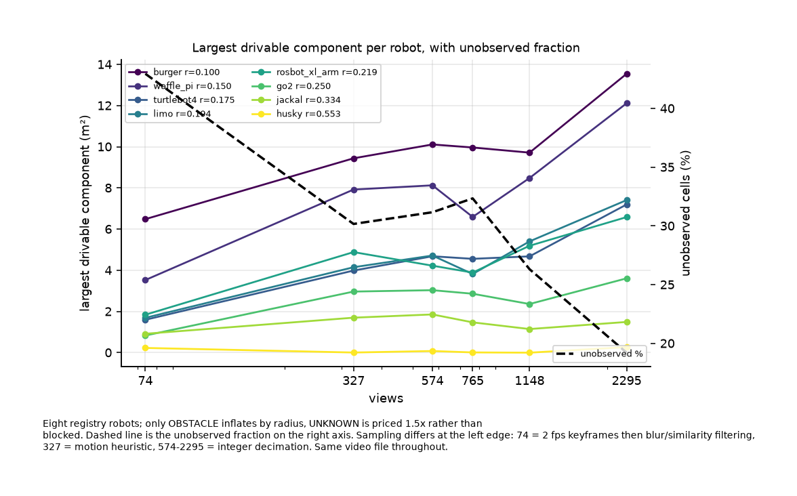
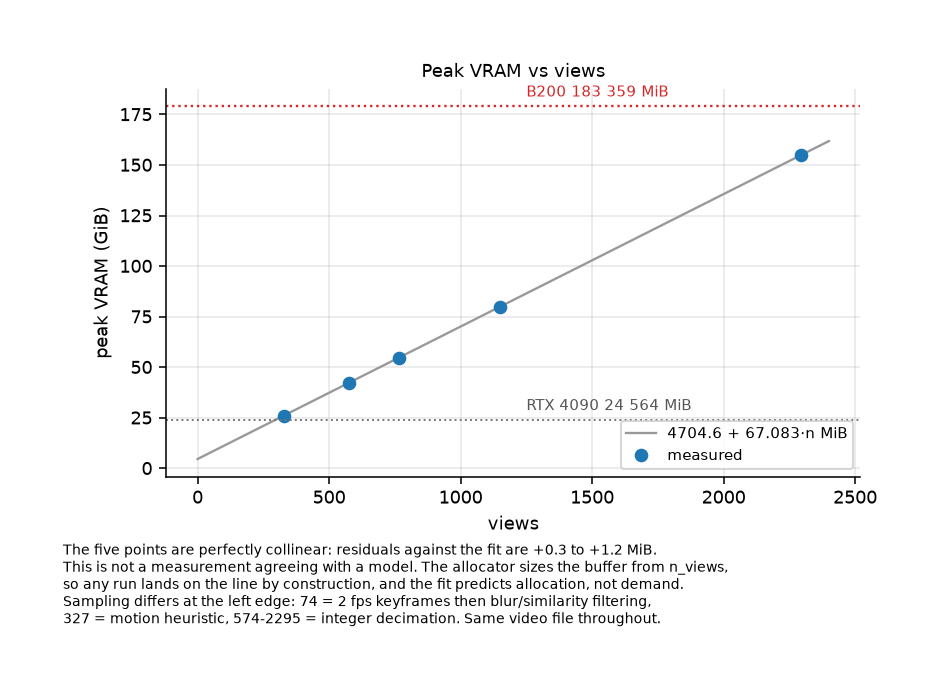

# Frame rate and what it buys: MapAnything pass A, nvblox pass B

Six view counts from one video, measured end to end. Pass A was run on a B200 on 2026-09-08;
pass B was run on an RTX 4090 on 2026-09-13 from the stored pass-A bundles, so no pass A was
repeated for this study.

## Method

**Input.** One video: 2295 frames, native 29.98897 fps, 76.53 s. One phone, one room.

**Rungs.** For five of six the rung is an integer decimation step over native fps and the
view count is derived; T1 lists views, fps and step per point.

All six rungs are the same video file, confirmed through the scene's video row.

Three sampling rules, not one. The 74-view scene asked for 2 fps keyframes and then let the
product extractor's blur and similarity filters run, which is why 76.53 s at 2 fps yields 74
views and not 153: those filters drop 6-77 % depending on content. The 327 rung came from a
motion heuristic. Only 574-2295 are integer decimation. Every figure caption repeats this,
because these two rungs sit at the left edge of every curve.

**Pass B.** `pipeline/run_pipeline.py` per point, `--from-pulled` the stored bundle,
`--nvblox-source live`, one 4090. Direct driver runs: artifacts only, no database rows.
Identical parameters across all five.

**Colour is off for all five.** `PACK_RGB` re-derives RGB with an ffmpeg modulo `select`,
which reproduces a frame list only when it is an arithmetic run; on the motion-sampled 327
rung it refuses rather than pair one frame's colour with another frame's depth. Four coloured
and one not would break identical parameters, so colour is off everywhere. It changes vertex
colour and transfer volume, not occupancy, components or routes.

**The 74-view point is taken as it stands** and was not re-run. Same band (0.1-1.5 m), same
0.05 m resolution, same `min_points_per_cell` as the five pass-B runs. It differs in one way
that matters, stated in Limitations: its grid is in the aligned product frame.

**Fixed parameters**, held across every point:

| parameter | value | source |
|---|---|---|
| nvblox TSDF voxel | 0.03 m | `pipeline/steps/nvblox_scenes.py:731` |
| band | 0.1-1.5 m | driver default, recorded per run |
| occupancy resolution | 0.05 m | `gpu/job_io.py:30` |
| `min_points_per_cell` | 3 | `gpu/stage_occupancy.py:44` |
| UNKNOWN cost multiplier | 1.5x | `app/services/pathfinding.py:35` |
| robot registry | 8 platforms, radii 0.100-0.5528 m | `app/robots.py` |

**Fixed target.** One app-frame coordinate, chosen once on the 74-view scene and applied
unchanged to every point after grid-origin alignment:

- `desk_1` point cluster centroid: x 2.5926, y 0.7326, z -2.2641; its own cell is OBSTACLE
  and therefore not a destination.
- **Target: x = 2.6043, z = -2.1714**, cell (81, 78) in the 74-view grid, the nearest FREE
  cell to that centroid, 0.100 m from it.
- Start: the 74-view scene's recorded robot start, x 0.00096, z -0.00119.

Each point's grid origin differs; the offset against the 74-view grid is printed per point.

**No semantics.** No object detection, vocabulary stage or VLM. Objects exist only on the
74-view scene, so no reach-by-object number is reported anywhere else.

## Results

### Observation

`coverage_raw` is a relative metric: it sizes its grid from each run's own point-cloud bbox,
a fixed K, and rewards spread. The percentage peaks at 765 views and falls; the count of
5 cm cells holding data rises the whole way. Only the four integer-decimation rungs carry
this measurement.

The tri-state grid from this study's own pass-B runs moves the other way and keeps moving:
unobserved falls from 42.95 % at 74 views to 19.21 % at 2295, non-monotone in the middle where
327, 574 and 765 cluster at 30-32 %. The gain from 4 fps to 10 fps is inside this scene's
noise; the step to every frame is not.

### T1 tri-state and unobserved

| views | fps | step | grid | FREE | OBSTACLE | UNKNOWN | unobserved % | grid-origin offset vs hero-74 (m) |
|---:|---:|---:|---|---:|---:|---:|---:|---|
| 74 | 2.0 | - | 111x142 | 6082 | 2910 | 6770 | 42.95 | (+0.000, +0.000) |
| 327 | 4.27 | - | 75x139 | 5436 | 1533 | 3456 | 30.17 | (-0.706, +2.420) |
| 574 | 7.50 | 4 | 76x143 | 5822 | 1355 | 3691 | 31.16 | (-0.741, +2.068) |
| 765 | 10.00 | 3 | 75x159 | 5898 | 1819 | 4208 | 32.34 | (-0.718, +1.304) |
| 1148 | 14.99 | 2 | 75x141 | 5979 | 1517 | 3079 | 26.32 | (-0.433, +3.208) |
| 2295 | 29.99 | 1 | 76x160 | 7472 | 1900 | 2788 | 19.21 | (-0.677, +2.716) |

### Drivable space

The largest drivable component grows with views for the six smallest platforms, roughly
doubling for most between 74 and 2295. Two readings the table does not give on its own:

- **Husky never gets a usable component.** At radius 0.5528 m the best rung produces 0.27 m²;
  three rungs produce 0.01 m² or less. Frames do not open a room too narrow for the robot.
- **Component growth is not reachable growth.** The right-hand value in T2 is the component
  the start actually sits in: zero for five of eight robots at every rung, and zero for all
  eight at 2295 views, where the start falls outside the largest component entirely.

### T2 drivable component: largest / containing the start, m2

| robot | radius m | 74 | 327 | 574 | 765 | 1148 | 2295 |
|---|---:|---:|---:|---:|---:|---:|---:|
| burger | 0.1000 | 6.49 / 2.13 | 9.44 / 9.44 | 10.11 / 10.11 | 9.96 / 9.96 | 9.71 / 9.71 | 13.54 / 0.00 |
| waffle_pi | 0.1500 | 3.53 / 1.20 | 7.92 / 0.00 | 8.13 / 8.13 | 6.59 / 0.00 | 8.48 / 8.48 | 12.11 / 0.00 |
| turtlebot4 | 0.1750 | 1.60 / 0.00 | 3.99 / 0.00 | 4.68 / 0.00 | 4.56 / 0.00 | 4.68 / 0.68 | 7.20 / 0.00 |
| limo | 0.1940 | 1.69 / 0.00 | 4.15 / 0.00 | 4.72 / 0.00 | 3.82 / 0.00 | 5.41 / 5.41 | 7.41 / 0.00 |
| rosbot_xl_arm | 0.2186 | 1.84 / 0.14 | 4.88 / 0.00 | 4.22 / 0.00 | 3.89 / 0.00 | 5.19 / 0.00 | 6.58 / 0.00 |
| go2 | 0.2496 | 0.83 / 0.00 | 2.97 / 0.00 | 3.04 / 0.00 | 2.86 / 0.00 | 2.36 / 0.00 | 3.61 / 0.00 |
| jackal | 0.3340 | 0.92 / 0.00 | 1.70 / 0.00 | 1.86 / 0.00 | 1.47 / 0.00 | 1.15 / 0.00 | 1.49 / 0.00 |
| husky | 0.5528 | 0.23 / 0.00 | 0.01 / 0.00 | 0.08 / 0.00 | 0.01 / 0.00 | 0.00 / 0.00 | 0.27 / 0.00 |

Left value is the largest component for that radius; right is the component containing the
start. Equal only where the start sits in the largest component.

### Peak VRAM

Five pass-A runs, residuals against `4704.6 + 67.083*n` MiB of +0.26 to +1.21 MiB. The points
are collinear because the allocator sizes the buffer from `n_views`; the line predicts
allocation, not demand, and a run cannot fall off it. Its one operational use is the ceiling:
2295 views allocates 158 661 MiB, which fits a 183 359 MiB B200 and no smaller card here.

### The fixed-target route is undefined at every point

No robot reaches the fixed target at any of the six rungs, and the reason differs by rung. On
the 74-view scene the start cell is not free at radius 0.175 m and above, and for the two
smallest robots the start and the target fall in different components: the desk is not
connected to the start. On the other five the target lands outside the grid entirely.

This is a property of the frames, not of frame rate. Each pass-B point sits in its own pass-A
frame and the 74-view point in the aligned product frame; the T1 offsets reach 3.2 m in z
against grids about 7 m deep, so one world coordinate names six different physical places.
The route columns are reported as measured; read the offset column first.

### T3 route to the fixed target (compact)

| views | robots reaching target | route m (min-max) | tightest gap m (min-max) | dominant reason when not |
|---:|---|---|---|---|
| 74 | 0/8 (none) | - | - | start cell not free for this radius |
| 327 | 0/8 (none) | - | - | start or target outside this point's grid |
| 574 | 0/8 (none) | - | - | start or target outside this point's grid |
| 765 | 0/8 (none) | - | - | start or target outside this point's grid |
| 1148 | 0/8 (none) | - | - | start or target outside this point's grid |
| 2295 | 0/8 (none) | - | - | start or target outside this point's grid |

### Cost and wall time

Pass B for all five rungs cost **$0.1487** on one RTX 4090 at $0.3556/hr. NVBLOX scales with
transfer, not compute: 171.8 s at 327 views against 304.2 s at 2295, a 1.8x rise across a 7x
rise in views, while PACK goes 6.6 s to 58.3 s. LAYERS and REACH stay flat.

### T4 pass-B wall time and cost

| views | PACK s | NVBLOX s | LAYERS s | REACH s | total s | cost USD |
|---:|---:|---:|---:|---:|---:|---:|
| 327 | 6.61 | 171.79 | 19.38 | 3.68 | 285.91 | 0.0274 |
| 574 | 15.06 | 182.3 | 8.65 | 3.51 | 279.0 | 0.0254 |
| 765 | 32.23 | 210.11 | 7.95 | 3.53 | 322.64 | 0.0281 |
| 1148 | 26.19 | 219.41 | 8.13 | 3.21 | 323.04 | 0.0287 |
| 2295 | 58.26 | 304.23 | 7.88 | 3.31 | 459.94 | 0.0391 |

## Limitations

1. **One video, one phone, one room**, a single 76.5 s walkthrough. Nothing separates what
   frame rate does from what this room does.
2. **Three sampling rules.** 74 = 2 fps keyframes then blur/similarity filtering, 327 =
   motion heuristic, 574-2295 = integer decimation. The two leftmost points on every curve
   were chosen differently from the other four; read the curves as series sharing an axis.
3. **The frames are not one frame.** The five pass-B points sit in their own pass-A frames,
   anchored at the first camera but each with its own MapAnything scale and drift; the
   74-view point is in the aligned product frame. The fixed target is one world coordinate
   applied to all six, so the grid-origin offset column is the correction that was not
   applied. Read that column before the route table.
4. **Pass A was not repeated.** Bundles were produced on 2026-09-08 across two sessions and
   two boxes; pass-A wall time and peak VRAM are read from those runs.
5. **`coverage_raw` sizes its own grid.** The percentage is not comparable across rungs; the
   cell count is. Both are plotted for that reason.
6. **One pass B per point**, so no variance estimate. Two runs of the 1148 rung on
   2026-09-10 produced identical mesh triangle counts on different boxes, which bounds
   run-to-run variation for that rung only.
7. **UNKNOWN is traversable at 1.5x, not blocked.** A component can grow because cells became
   FREE or because they became UNKNOWN. Read the unobserved fraction beside every component.

## What this does not show

- **No lighting or texture ablation.** One capture, one exposure. "More views help" and
  "these particular frames help" are not separated.
- **Confidence masks are unused.** Per-view `conf` is stored raw and unthresholded and no
  stage here filters on it; the 327 and 2295 bundles do not carry `conf` at all.
- **No semantics outside the 74-view point.** Object counts and every by-object route belong
  to that scene only.
- **No pass-A quality metric.** Nothing here re-derives reconstruction accuracy against
  ground truth.
- **No claim about a knee.** The saturation threshold that picked 1148 views elsewhere is an
  operator stopping rule, not a measurement, and is not tested here.
