# User guide

A tour of the screens, in the order you meet them. Captured at 1440×900 against a real
database; every number shown is a real measurement, not a mock-up.

Read [Limits](../README.md#limits) before trusting any of these numbers. There is **no
authentication**: anyone who can reach the port can do everything shown here.

## Workspaces

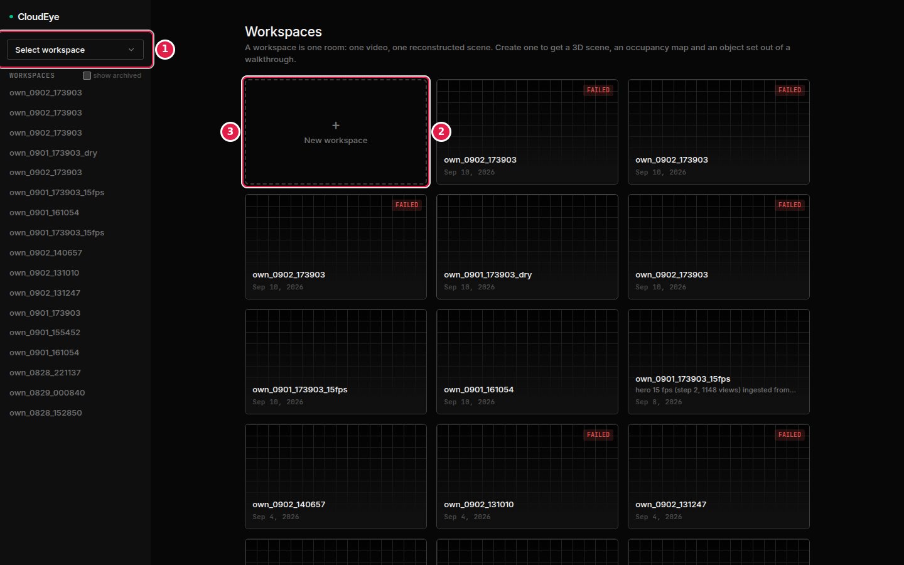

**What you do:** pick a room to open, or start a new one. A workspace is one room — one
video, one reconstructed scene.

**① Workspace switcher.** Jumps between rooms without going back to this list.
**② A workspace card.** The thumbnail is that scene's map preview; the date is the upload.
A red `FAILED` badge means the reconstruction did not pass the validation gate — rejected
rather than written half-populated, so there is nothing to open. Re-shoot the room; the
capture guide behind the **?** button says how.
**③ New workspace.** Opens the upload wizard.

## Upload wizard

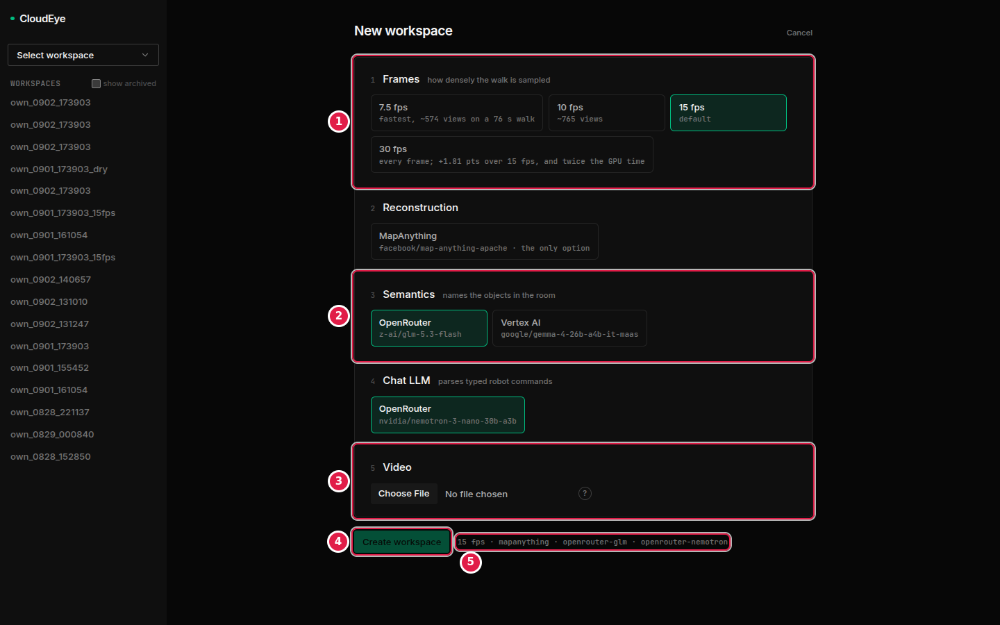

**What you do:** choose how densely to sample the walk, pick the models, choose a file,
and create. Everything has a working default — you can go straight to step 5.

**① Frames.** How densely the walk is sampled. The sublabels are measured on real footage:
7.5 fps gives ~574 views on a 76-second walk, 15 fps ~765, and 30 fps buys **+1.81 points
of overlap over 15 fps for twice the GPU time** — which is why 15 fps is the default rather
than the highest setting.
**② Semantics.** Which model names the objects. OpenRouter (`z-ai/glm-5.3-flash`) is the
default; Vertex AI is the alternative and needs Google credentials —
see [GOOGLE_CLOUD.md](GOOGLE_CLOUD.md). A provider that is not answering is shown greyed
out here rather than failing after upload.
**③ Video.** The walkthrough file. `ffprobe` reads its duration and resolution on upload.
**④ Spec preview.** The exact job spec that will be written to disk, in one line:
`15 fps · mapanything · openrouter-glm · openrouter-nemotron`. It is what the worker reads,
so what you see here is what runs.
**⑤ Create workspace.** Queues the job and takes you to the processing screen.

## Processing

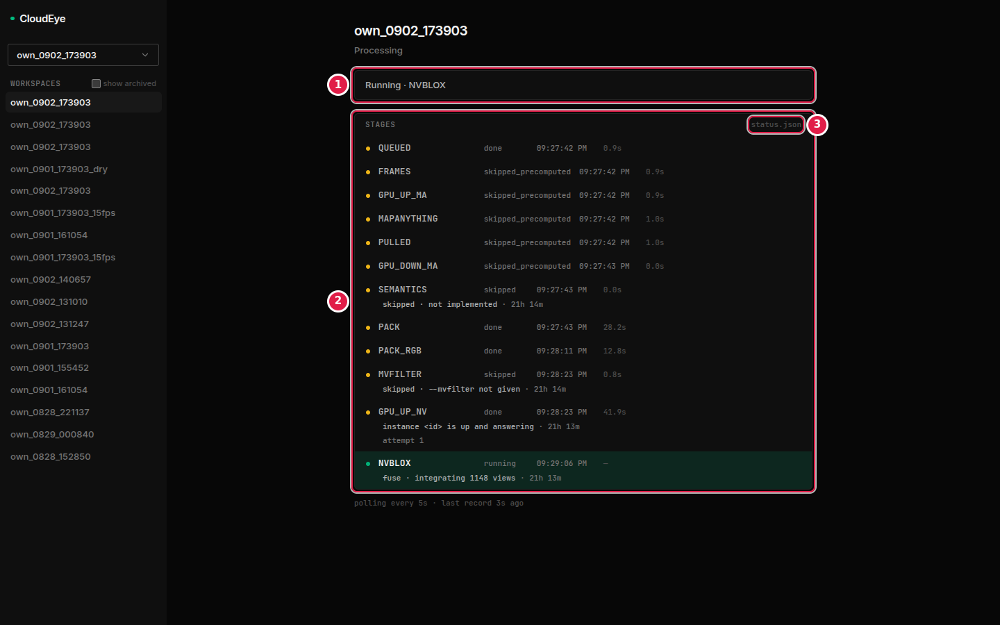

**What you do:** watch, or leave — the page polls every 5 s and redirects to the scene the
moment it is done.

**① Current state.** `Running · NVBLOX` is the stage the driver is in right now.
**② Stage feed.** One row per pipeline stage, with its state, the wall-clock time it
started and how long it took. Three states worth knowing: `done` ran here;
`skipped_precomputed` means the output already existed and was reused (which is what makes
a re-run cheap); `skipped` means the stage did not run at all, and the second line says
why — `SEMANTICS · skipped · not implemented` is the honest statement that this driver
does not name objects yet, and `MVFILTER · skipped · --mvfilter not given` that the
optional filter was not requested. `NVBLOX · running · fuse · integrating 1148 views` is
the live substage and its detail.
**③ Where the feed comes from.** `status.json` is the file the pipeline writes on the GPU
box. When neither it nor a worker log exists the list stays empty and says so — nothing on
this screen is invented.

*(This shot replays a recorded run at the moment NVBLOX was still fusing. The stage names
and timings are that run's own; the rented instance id is masked, as it is everywhere else
in this repository.)*

## The scene, in 2D

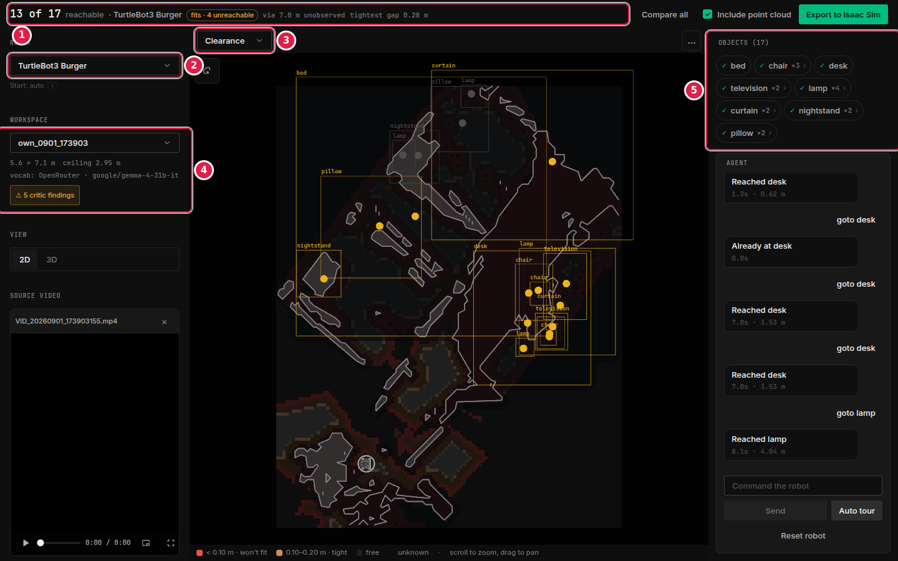

**What you do:** read the room the way the planner reads it. Scroll to zoom, drag to pan.

**① Verdict bar.** `13 of 17 reachable · TurtleBot3 Burger` — of 17 detected objects, 13
can be driven to by this platform. `fits · 4 unreachable` says the robot fits through the
room at all, and four objects still cannot be reached. `via 7.0 m unobserved` is how much
of the route crosses ground the camera never saw. `tightest gap 0.28 m` is the narrowest
passage on the reachable route set — compare it to the robot's own width.
**② Robot.** The platform everything on this screen is computed for. Change it and every
number above recomputes.
**③ Render mode.** `Clearance` colours each map cell by how much room a robot has there.
The legend at the bottom gives the thresholds for the selected platform: red
`< 0.10 m · won't fit`, amber `0.10–0.20 m · tight`, then free and unknown.
**④ Room summary.** Measured footprint and ceiling height, which model named the objects,
and the validator's findings. `5.6 × 7.1 m  ceiling 2.95 m` are reconstruction outputs, not
inputs.
**⑤ Object list.** Detected objects grouped by name; `×3` means three instances.

## Occupancy

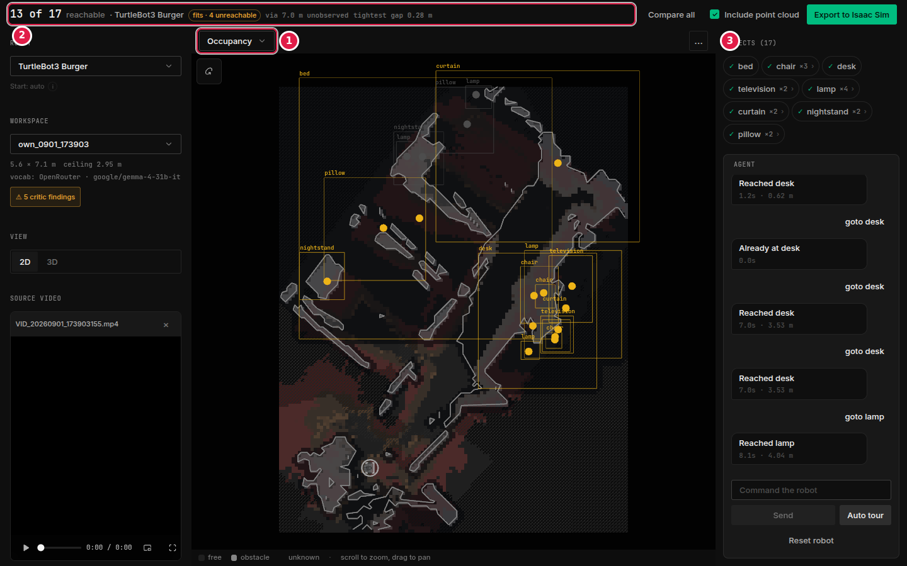

**What you do:** switch the render mode to `Occupancy` to see what was actually observed.

**① Render mode.** `Occupancy` replaces the clearance colouring with the grid's three raw
states, and the legend changes to match: **free**, **obstacle**, **unknown**.
**② The same verdict bar**, unchanged — the map colouring is a view, not a different map.
**③ The hatched region is `unknown`.** It is not free space. The grid is a point-density
histogram with no ray-based free-space carving, so a cell with no points may be genuinely
empty or simply never seen. On this scene 43% of the grid was never directly observed.
That is why the verdict bar reports unobserved metres separately, and why walls have holes
where the camera never looked.

## The scene, in 3D

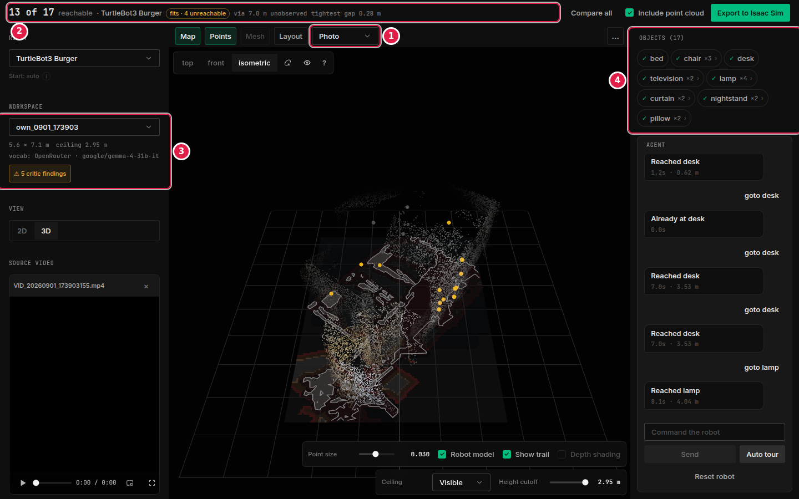

**What you do:** switch to **3D** in the left panel, then pick a colouring.

**① Render mode — `Photo`.** Each point keeps the colour it had in the source video.
**② Verdict bar**, unchanged from 2D.
**③ Room summary.** Same measurements.
**④ Object list.** Same objects; the yellow markers in the canvas are their centres.

Bottom-right: point size, the robot model and its trail, and a ceiling cutoff — drop it to
look into the room from above without the ceiling in the way.

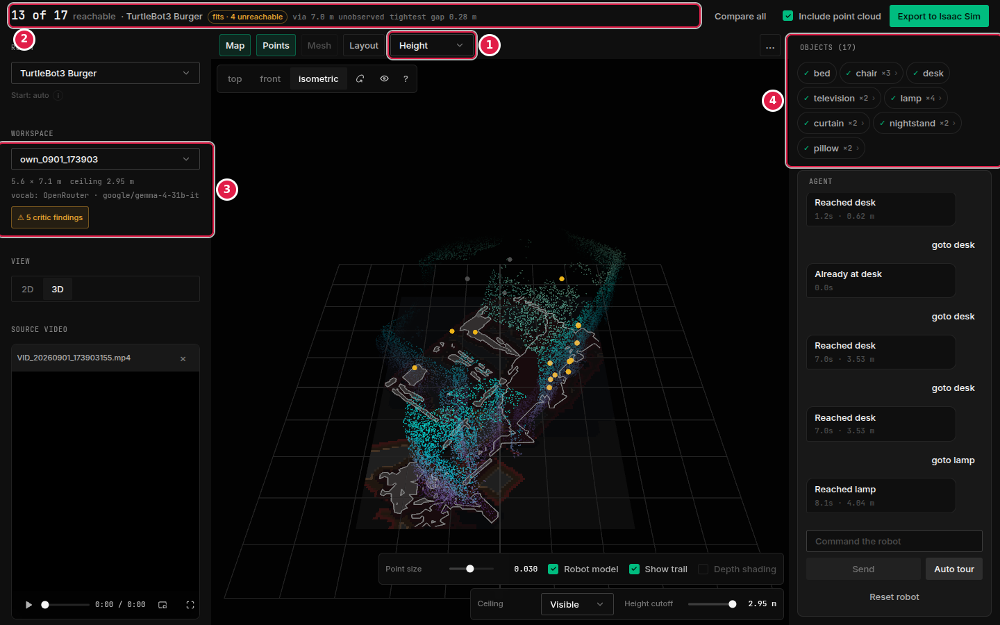

**① Render mode — `Height`** colours every point by its world height instead, so the
floor, furniture tops and ceiling separate out. Use it to sanity-check the floor fit: a
reconstruction where the floor and ceiling were swapped is obvious here and subtle in
`Photo`.

## Choosing a robot

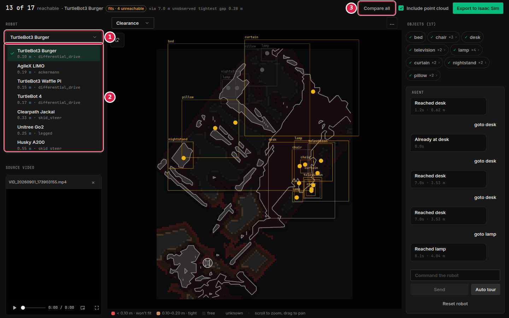

**What you do:** pick the platform to plan for.

**① Robot picker**, open. **② The platforms**, each with the two numbers that decide
everything downstream: its footprint radius in metres and its drive type — `0.10 m ·
differential_drive` for the TurtleBot3 Burger up to `0.55 m · skid_steer` for the Husky
A200. The radius is what the planner inflates obstacles by.
**③ Compare all** runs every platform against this scene at once and prints the
reachable-of-total for each, so you can see where a bigger robot stops fitting.

## Objects, and what "unreachable" means

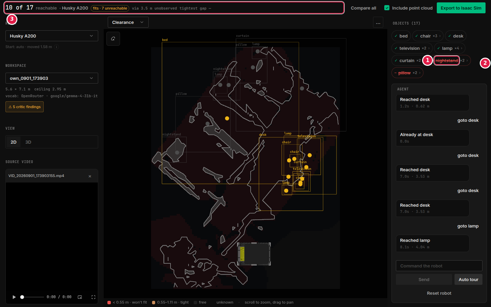

**What you do:** switch to a larger robot and watch the list change.

**① An unreachable object.** `nightstand` is struck through and red. Nothing about the
object changed — the Husky A200's 0.55 m radius did. Expand a group to see the backend's
own reason per object; the UI prints that reason verbatim and never invents a gap
measurement where none was taken.
**② The list** now shows both `nightstand` and `pillow` struck through.
**③ The verdict bar** recomputed: `10 of 17 reachable · Husky A200 · fits · 7 unreachable`,
against 13 of 17 for the Burger. `tightest gap —` is an em dash, not zero: the Husky fits
in none of the fit-probability trials on this scene, so there is no successful trial to
take a percentile over and no gap figure exists.

## Commanding the robot

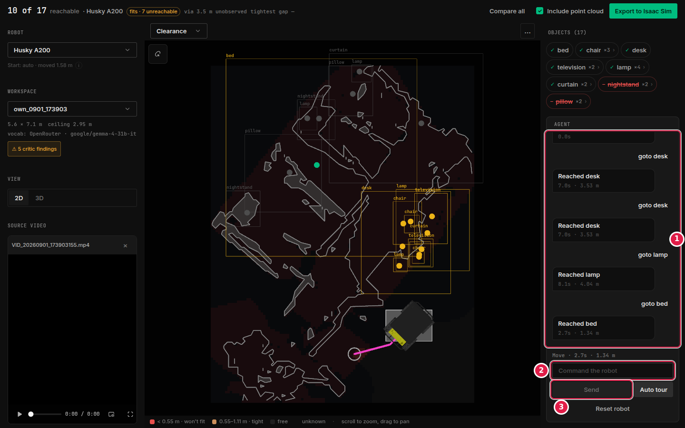

**What you do:** type a command and press Send. Four forms work with no model configured
at all: `go to <object>`, `can <robot> reach <object>`, `compare all`,
`move <object> <dx> <dy>`. Anything else goes to the chat LLM.

**① The transcript.** `goto bed` → `Reached bed · 2.7s · 1.34 m`: the route was planned,
it is 1.34 m long, and at this platform's speed it takes 2.7 s. The pink line on the map is
that route and the robot is drawn at its destination. A command that cannot be planned
says so with the backend's reason instead of a route.
**② The input.** Object names autocomplete from this scene's own vocabulary.
**③ Send.**

No route ever crosses a cell the layer calls an obstacle — asserted by
`tests/acceptance/probe_route_obstacles.py`. See
[one map for the planner](../README.md#one-map-for-the-planner).

## Export

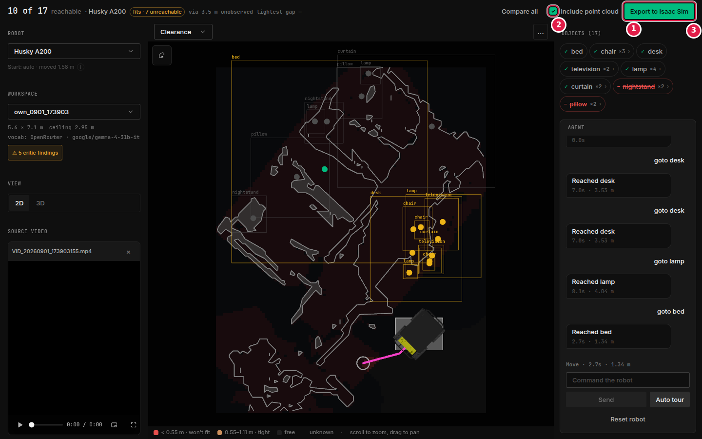

**What you do:** download the scene as OpenUSD, at metric scale.

**① Export to Isaac Sim** downloads the `.usd`. Floor and walls are axis-aligned boxes
built from the occupancy grid; each object gets the convex hull of its own captured points,
which is conservative — never smaller than the real shape.
**② Include point cloud** decides whether the raw points ride along. Off keeps the file
small; on is what you want for visual inspection.
**③ The toolbar** stays on every scene view, so the export is one click from wherever you are.

Isaac Sim 6.0.1 is the **target** for this file; it has not been opened in a live install —
see [ISAAC_VALIDATION.md](ISAAC_VALIDATION.md).

## A second room

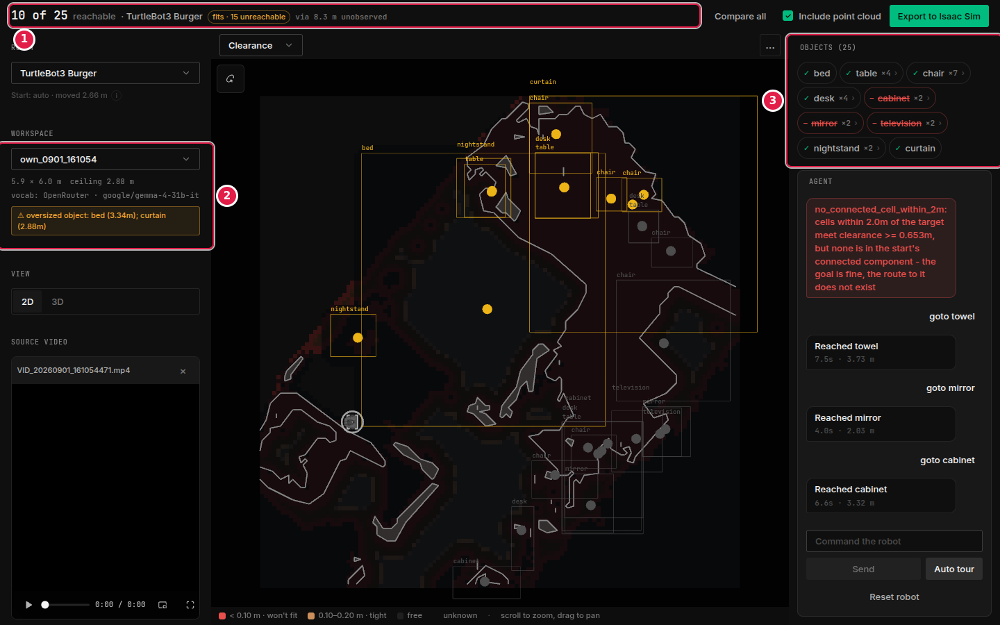
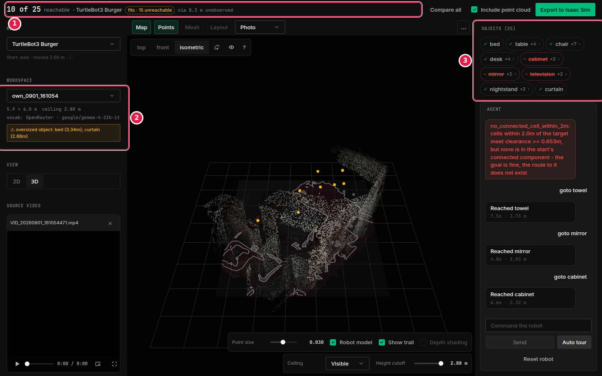

The same screens on a different room (`own_0901_161054`, 25 objects). Two things to notice:
the verdict reads `10 of 25 reachable · fits · 15 unreachable`, and the room summary
carries a validator warning — `oversized object: bed (3.34 m); curtain (2.88 m)`. The
validator flags objects larger than their type's height prior rather than silently
accepting them. A warning is not a rejection: the scene is usable, and the number is telling
you which objects to distrust.
